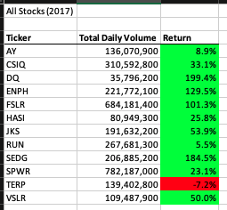
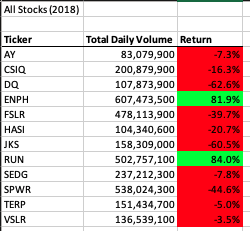
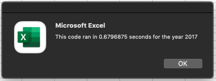
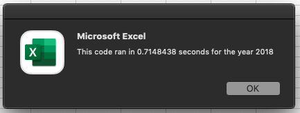
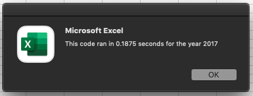
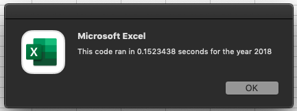

# Stock Analysis for Steve
# Overview
### Background
-
### Purpose
-
# Results
### Stock Performance Comparisons between 2017 and 2018
When comparing stock performaces between 2017 and 2018, the most important note to make is that in 2018 there was not enough of a daily volume for several of the stocks to have a positive return. Only two stocks, ENPH and RUN, would be considered as a "good investments" because there return rate was over 80% and their daily volume increased over $200 million within a year. 

To take this analysis further for Steve, we can show with the tables below that although DQ's daily volume tripled the volume was not enough to account for a positive return. This can be shown by taking a look at the data below:



  
### Comparing Original and Refactored Analysis
#### Script Comparison
With the original script, the analysis was based within a nested for loop. This means that there was an inner loop which was performing the stock analysis, and also outside of the inner loop (the outer loop) the script would output the relevant data for the stock.
```vba
'Loop through the tickers.
For i = 0 To 11
  ticker = tickers(i)
  totalVolume = 0
'Loop through all the rows on the designated year sheet.
    For j = 2 To RowCount
      ' Calculating the total daily and return. Full code in the files attached in the repo.
  ' End looping through the sheet
    Next j
'Within the ticker loop we will output the prices
  Worksheets("All Stocks Analysis").Activate
  Cells(4 + i, 1).Value = ticker
  Cells(4 + i, 2).Value = totalVolume
  Cells(4 + i, 3).Value = endPrice / startingPrice - 1
Next i
```
Looking at the refactored script we have broken up the nested for loop into three loops, which allow the analysis to run much faster. In the refactored script, we have implemented a tickerIndex which we are using rather than looping through the tickers in an outer loop. Another difference is that we are saving all stock analysis values within individual arrays, which means we separated the analysis and output from the previous inner loop into two separate loops with refactoring. 
````vba
'For loop to initialize the tickerVolumes array to zero.
For i = 0 To 11
  tickerVolumes(i) = 0
Next i

'Looping over all the rows in the designated year sheet
For i = 2 To RowCount
  ' Increase volume for current ticker
  ' We use tickerIndex as the index for the tickers array, rather than an outer loop
  If Cells(i, 1).Value = tickers(tickerIndex) Then
    tickerVolumes(tickerIndex) = tickerVolumes(tickerIndex) + Cells(i, 8).Value
  End If
  
  ' Find tickerStartingPrices array using if the current row is the first row with the selected tickerIndex. 
  If Cells(i - 1, 1).Value <> tickers(tickerIndex) And Cells(i, 1).Value = tickers(tickerIndex) Then
    tickerStartingPrices(tickerIndex) = Cells(i, 6).Value
  End If
  
  ' Find tickerEndingPrices using if the current row is the last row with the selected ticker.
  If Cells(i + 1, 1).Value <> tickers(tickerIndex) And Cells(i, 1).Value = tickers(tickerIndex) Then
    tickerEndingPrices(tickerIndex) = Cells(i, 6).Value
    ' Increase the tickerIndex here rather than having these values be placed in a nested for loop.
    ' Increasing the tickerIndex here saves us processing time.
      tickerIndex = tickerIndex + 1
  End If
Next i

' Loop through your arrays to output the Ticker, Total Daily Volume, and Return.
For i = 0 To 11 
  ' Output data for current ticker on current sheet, using the new index.
  ' Full code not shown in this preview to save space and show process, full code in the repo.
  Cells(4 + i, 1).Value = tickers(i)
Next i
````
#### Run Time Comparison
After refactoring and comparing the scripts, we can also show how refactoring improved our run time. Our original script for both 2017 and 2018, ran for about 0.7 seconds while our refactored script ran for about 0.16 seconds for both. This means that our analysis was improved by 0.5 seconds with the refactored script.

Below are screenshots showing the exact run times we produced. The following images are from our original script:



The next images are from our refactored script, you can see here how the time decreased for both years:



# Summary
## Advantages and/or disadvantages of Refactoring Code
-
## Pros and Cons of applying refactoring to the original VBA script
-
